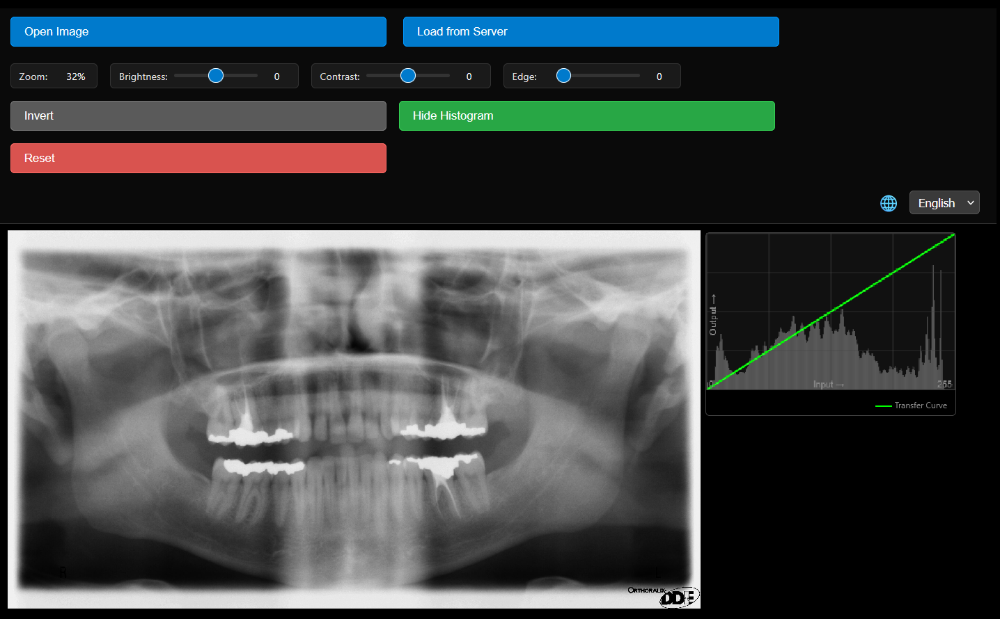

# Tooth ’n’ Zoom - Dental Educational Darkrom

A pedagogical tool designed specifically for dental education in oral radiology. This viewer allows instructors to provide radiographic examples to students and enables basic image manipulation for educational purposes.

<figure>
  
  <figcaption>Screenshot displaying panoramic image from [Wikipedia](https://en.wikipedia.org/wiki/Panoramic_radiograph)</figcaption>
</figure>

<p>&nbsp;</p>

**Educational Tool Notice**: This viewer is strictly an educational tool for teaching oral radiology concepts. It is **NOT** intended for clinical diagnosis or patient care. Always use certified medical imaging software for clinical applications.

## Purpose & Scope

### What This Tool IS:
- **Educational Platform**: For teaching oral radiology interpretation
- **Student Learning Tool**: Allows hands-on practice with radiographic images
- **Teaching Aid**: Helps instructors demonstrate imaging concepts
- **Interactive Learning**: Students can manipulate images to understand radiographic principles

### What This Tool IS NOT:
- Not a diagnostic tool
- Not for clinical decision-making
- Not a PACS replacement
- Not for patient treatment planning

## Features

### Core Functionality
- **Image Loading**: Upload, drag & drop, server browser, URL loading
- **Advanced Image Adjustments**: 
  - Brightness control (-100 to +100)
  - Enhanced contrast range with extreme black/white mode
  - Edge enhancement filter
  - Image inversion
- **Interactive Histogram Display**:
  - Luminance distribution visualization
  - Real-time transfer curve overlay showing brightness/contrast mapping
  - Draggable panel for flexible positioning
- **Zoom & Pan**: Detailed examination (10% to 1000% zoom)
- **Multi-language Support**: English and Norwegian

### Image Processing Capabilities

#### Contrast Enhancement
The contrast control now features two distinct modes:
- **Normal Range (-100 to 50)**: Traditional contrast adjustment
  - -100: Completely flat (all pixels become middle gray)
  - 0: No adjustment
  - 50: Enhanced contrast with preserved tonal range
- **Extreme Mode (50 to 100)**: Threshold-based processing
  - 50-95: Progressive sigmoid curve creating dramatic contrast
  - 95-100: Near-binary black/white threshold effect

#### Histogram & Transfer Curve
- **Luminance Histogram**: Shows the distribution of brightness values (0-255)
- **Transfer Curve** (green overlay): Real-time visualization of how input values map to output values
  - Diagonal line = no adjustment
  - Curve above diagonal = brightening
  - Curve below diagonal = darkening
  - Steep curve = high contrast
  - Flat curve = low contrast

### Controls

**Mouse**:
- Left-drag: Pan
- Wheel: Zoom
- Middle-drag: Adjust brightness/contrast
- Ctrl + Left-drag: Zoom

**Touch** (tablets):
- 1-finger: Pan
- Pinch: Zoom
- 2-finger drag: Adjust brightness/contrast

**Keyboard**:
- `+`/`=`: Zoom in
- `-`: Zoom out
- `0`: Reset zoom
- `I`: Toggle invert
- `Ctrl+R`: Reset all adjustments
- Arrow keys: Pan

**Histogram Panel**:
- Click and drag to reposition anywhere on screen
- Toggle visibility with Histogram button

## Quick Start

### For Local Use
1. Open `index.html` in a modern web browser
2. Click "Open Image" to load radiographs
3. Or drag and drop image files directly

### For Classroom Server
1. Place teaching radiographs in `images/` folder
2. Update `images/file_list.json` with filenames:
```json
[
  "periapical-1.jpg",
  "bitewing-1.jpg",
  "panoramic-1.jpg"
]
```
3. Run a local server:
```bash
python -m http.server 8000
```
4. Access at `http://localhost:8000`

## Project Structure

```
dental-radiograph-viewer/
├── index.html              # Main application
├── js/
│   ├── app.js             # Application initialization
│   ├── viewer.js          # Core viewing functionality
│   ├── image-processor.js # Image manipulation algorithms
│   ├── controls.js        # User interaction handlers
│   ├── utils.js           # Helper functions
│   ├── language-manager.js # i18n support
│   └── languages.json     # Translations
├── images/                # Sample radiographs
│   └── file_list.json     # Image catalog
└── README.md             # Documentation
```

## Design Rationale

The **pure black background** (#000000) serves important pedagogical purposes:
- Mimics professional clinical viewing conditions
- Reduces eye fatigue during extended study
- Provides optimal contrast for radiographic details
- Minimizes distractions
- Familiarizes students with professional standards

## Understanding the Histogram

The histogram display provides two key pieces of information:

1. **Luminance Distribution** (white bars):
   - X-axis: Pixel brightness values (0 = black, 255 = white)
   - Y-axis: Frequency of pixels at each brightness level
   - Helps identify exposure issues:
     - Left-heavy: Underexposed
     - Right-heavy: Overexposed
     - Well-distributed: Good tonal range

2. **Transfer Curve** (green line):
   - Shows the mathematical transformation applied by brightness/contrast adjustments
   - Input values (horizontal) mapped to output values (vertical)
   - Useful for understanding how adjustments affect the image
   - At extreme contrast settings, approaches a step function for threshold effects

## System Requirements

- Modern web browser (Chrome, Firefox, Safari, Edge)
- JavaScript enabled
- Screen resolution: 1024x768 or higher
- 4GB RAM recommended

## Educational Use Cases

### Classroom Activities
- Group analysis of radiographs
- Demonstration of exposure effects
- Interactive anatomy review
- Pathology identification practice
- Student case presentations
- Teaching histogram interpretation
- Demonstrating the effects of image processing

### Self-Study
- Exam preparation
- Practice sessions
- Homework assignments
- Research projects
- Understanding image processing concepts

## Customization

Adjust sensitivity in `js/controls.js`:

```javascript
export const CONFIG = {
    ZOOM_WHEEL_FACTOR: 1.1,      // Zoom speed
    BRIGHTNESS_SENSITIVITY: 0.5,  // Brightness adjustment rate
    CONTRAST_SENSITIVITY: 0.5,    // Contrast adjustment rate
    MAX_ZOOM: 10,                // Maximum zoom (1000%)
    MIN_ZOOM: 0.1                // Minimum zoom (10%)
};
```

## Troubleshooting

**Images not loading from server**:
- Check that you're running a web server (not `file://`)
- Verify `images/file_list.json` exists and is correct
- Check browser console for errors

**Server browsing on UiO network**:
- Authentication may block JSON file loading
- Use local file upload instead ("Open Image" button)

**Transfer curve not visible**:
- Ensure browser cache is cleared (Ctrl+F5 or Cmd+Shift+R)
- Verify both `viewer.js` and `image-processor.js` are updated
- Check browser console for JavaScript errors

## Technical Notes

### Image Processing Algorithm
The viewer uses different algorithms based on the contrast setting:
- **Standard mode**: Linear contrast adjustment with preserved color relationships
- **Extreme mode**: Luminance-based sigmoid transformation for dramatic effects
- All processing is done in real-time on the canvas

### Performance Considerations
- Large images (>4MP) may show slight lag during real-time adjustments
- Edge enhancement is computationally intensive and may affect performance
- Histogram updates automatically when adjustments are made

## Important Disclaimers

1. **Educational Use Only**: Designed exclusively for teaching oral radiology
2. **Not for Diagnosis**: Never use for clinical diagnosis or treatment
3. **Student Practice Tool**: For supervised educational activities only
4. **No Patient Data**: Use only teaching materials or properly anonymized images

## Version History

### Latest Update
- Enhanced contrast range with extreme black/white threshold mode
- Added real-time transfer curve visualization in histogram
- Made histogram panel draggable for flexible positioning
- Improved contrast algorithm for better radiograph enhancement

## License

MIT License - Free for educational use

## Support

For issues or suggestions, please open an issue on GitHub.

---

**Remember**: This is a teaching tool for learning radiographic interpretation. For clinical applications, always use certified medical imaging software.
